# hwatu

[](https://github.com/hongnoul/hwatu/releases)
[](LICENSE)
[](https://github.com/hongnoul/hwatu/actions/workflows/ci.yml)

A daemon-based web browser for tiling window managers. Real WebKit rendering,
terminal-emulator spawn times.

hwatu treats the browser window as a resource that other programs manage.
For humans, that program is your tiling WM. For coding agents, it's the
agent harness: see [docs/agents.md](docs/agents.md).



## Installation

```bash
curl -fsSL https://raw.githubusercontent.com/hongnoul/hwatu/main/scripts/install.sh | bash
```

Requires `webkitgtk-6.0` at runtime (the installer checks and tells you the
package for your distro). Or build from source:

```sh
cargo build --release   # needs rust + webkitgtk-6.0 dev headers
```

## Why

Browsers conflate two things: the engine (slow to start, RAM-hungry) and the
window (what you actually ask for). hwatu splits them, the same way
`emacsclient`/`wezterm` do:

- **`hwatud`** owns WebKitGTK 6, a prewarmed WebView pool, and all windows.
- **`hwatu`** is a thin client: one Unix-socket roundtrip to open a window.

Measured: **13 ms median** (p90 35 ms) from `hwatu <url>` to a mapped,
loading window on a warm daemon; `--background` and `--headless` land at
16 ms and 14 ms medians. The first-ever window pays a one-time engine/GPU
init (~200-400 ms). Full data and methodology: [docs/benchmarks.md](docs/benchmarks.md).

## hwatu vs surf, qutebrowser, luakit

If you want a minimal browser for a tiling window manager (Hyprland, sway, i3,
river), the usual suspects trade differently:

| | hwatu | surf | qutebrowser | luakit |
|---|---|---|---|---|
| Window spawn | 13 ms median (warm daemon) | full engine start per window | full engine start | full engine start |
| Engine | WebKitGTK 6 | WebKitGTK 2 | QtWebEngine (Chromium) | WebKitGTK 2 |
| Tabs | none, WM tiles are tabs | none | built-in | built-in |
| Keyboard-driven UI | your WM's binds | patches | first-class vim binds | lua config |
| Memory model | one shared engine, N views | one process per window | one big process | one process |

Honest take: if you want vim keybindings *inside* the browser, use qutebrowser.
If you want windows that appear as fast as terminals and a WM that does the
window management, that's what hwatu is for. surf pioneered this shape; hwatu
adds the warm daemon and a current engine.

## Philosophy

- **No tabs.** A tab is a window. Your tiling WM is the tab manager.
- **No chrome.** The WebView is the whole window.
- **Real rendering.** Full WebKit: JS, CSS, media, WebGL, as the frontend
  intended. No custom half-engine.
- **No ads.** Content blocking is built in and on by default, evaluated
  natively in WebKit's network process — zero JS, zero UI, zero spawn cost.

## Usage

```sh
hwatu                      # open the launcher (autostarts hwatud)
hwatu example.com          # open a URL (https:// implied)
hwatu how to exit vim      # anything that isn't a URL is a web search
hwatu --app-id mail url    # per-window app_id for WM window rules
hwatu list                 # id, url, title of every window
hwatu list --json          # same, as JSON (for wofi/rofi pipelines)
hwatu close 2              # close window 2
hwatu adblock              # content-blocker status (rule count, source)
hwatu adblock off          # disable blocking (persisted; `on` re-enables)
hwatu adblock update       # fetch EasyList + EasyPrivacy, recompile
hwatu update               # self-update to the latest release
hwatu quit                 # stop the daemon
```

### Automation (for coding agents)

The daemon speaks a small automation protocol, built for AI coding
agents (jcode has a native hwatu backend) and scripts that need to
verify web UIs. A full verification pass (open headless, wait for
load, eval, screenshot, close) measures **216 ms median**, ~75 ms
without the screenshot ([docs/benchmarks.md](docs/benchmarks.md)).
Full guide: [docs/agents.md](docs/agents.md).

```sh
hwatu --background localhost:3000           # open without stealing focus
hwatu --headless localhost:3000             # open with no window at all
hwatu eval 'return document.title'          # run JS in the page (async, JSON out)
hwatu eval --id 2 'return location.href'    # target a window by id
hwatu goto localhost:3000                   # navigate + wait for the load
hwatu goto --no-wait example.com            # navigate without waiting
hwatu shot /tmp/page.png                    # screenshot the viewport (PNG)
hwatu wait-load                             # block until the current load settles
hwatu upload 'input[type=file]' ./pic.png   # set a file input's files from disk
hwatu focus 2                               # raise/focus window 2 (materializes
                                            # background/headless windows)
```

`eval` takes a JavaScript *function body*: `return` works, `await`
works, and a returned Promise is awaited before the result comes back
as JSON. Without `--id`, commands target the focused window (or the
only window). Everything is one JSON request over the Unix socket
(`$XDG_RUNTIME_DIR/hwatu.sock`), so any language can drive it directly.

A `--headless` window is a live session the WM never sees: an agent
can drive and screenshot it, and `hwatu focus <id>` later materializes
that exact session as a normal window for the human to inspect.

Agents get `--background` without asking for it: when `hwatu` runs
inside a coding-agent environment (detected by markers like
`CLAUDECODE`, `JCODE_SOCKET`, `CURSOR_AGENT`), opens default to
background so a verification flow never steals the human's focus.
Human entries (shells, WM keybinds) keep the normal focused open, and
an agent can pass `--focus` to deliberately show the user a window.
Because most tilers focus new windows regardless, the installer offers
(default yes) to add a no-initial-focus rule for app-id
`hwatu-background` to your niri/Hyprland/sway config; preseed
`HWATU_WM_RULE=no` to skip.


`Ctrl+w` (or `Ctrl+q`) closes the focused window. `Ctrl+l` (or `O`) opens the URL
bar prefilled with the current address, `o` opens it blank; `Enter`
navigates, `Esc` cancels. `Ctrl+o` / `Ctrl+i` go back/forward in
history (vim jumplist style). `Ctrl+r` / `F5` reload the page.
`Ctrl+Shift+j` / `Ctrl+Shift+k` scroll
the page down/up by half a viewport. The daemon and engine stay warm.

Every bind is remappable in `~/.config/hwatu/keys.conf`, one
`action = chord[, chord...]` per line (`none` unbinds):

```
back     = ctrl+o, alt+Left
forward  = ctrl+i, alt+Right
url_edit = ctrl+l, O
close    = none
```

Chords are `[ctrl+][alt+][shift+]key`; a key is a character (`o`, `/`)
or a GDK key name (`slash`, `Left`, `Page_Down`). Uppercase implies
shift. Actions: `close`, `url_open`, `url_edit`, `find`, `find_back`,
`find_next`, `find_prev`, `scroll_down`, `scroll_up`, `back`,
`forward`, `reload`. Chords with ctrl/alt always win over the page; bare keys
reach the page first (an `o` typed in a text box stays in the page).

On Wayland, `--app-id` names the window for your compositor's rules:

```
# hyprland
windowrule = workspace 3, class:mail
# sway
assign [app_id="mail"] workspace 3
```

Unfocused windows are suspended after `HWATU_DISCARD_SECS` (default
120): navigation history is serialized to `~/.cache/hwatu/discard/`,
the web process is killed, and the RAM comes back. Focusing the window
restores it from the prewarm pool, so resume feels instant. If a page's
web process crashes or is OOM-killed, the bar offers
`page crashed, reload? [y/n]` instead of leaving a white window.

If the *daemon* dies uncleanly (crash, OOM kill, logout), the next
`hwatud` reopens every window at its last URL: the open-window set is
snapshotted to `~/.local/state/hwatu/session.json` as you browse. A
clean `hwatu quit` removes the snapshot, so intentional exits stay
exits.

## The bar

hwatu's one piece of chrome: a single-line vim-style bar at the bottom
of the window, hidden until summoned. Everything interactive lives
there, so the resting state stays chromeless.

- **The launcher**: a bare `hwatu` opens a keybind cheat sheet with
  the URL bar already open — type a URL or search and hit Enter.
  `Esc` closes an untouched launcher window, so a mis-fired keybind
  costs nothing. Set `HWATU_HOME` to get a home page instead.

- **Open a URL**: `Ctrl+l`/`O` edit the current address, `o` starts
  blank. Input is normalized like the CLI (`example.com` gets
  `https://`, loopback hosts get `http://`), and anything that
  doesn't look like a URL becomes a web search.
- **Web search**: input with spaces or without a dot (`rust borrow
  checker`, `vim`) searches with your configured engine. The
  installer asks which one (DuckDuckGo, Google, Bing, Brave,
  Startpage, Kagi, Ecosia — default DuckDuckGo); change it any time
  in `~/.config/hwatu/search.conf`, either an engine name or a URL
  template like `https://example.com/search?q=%s`. Applies without
  a daemon restart.
- **Find in page**: `/` opens forward search, `?` backward. Matches
  highlight incrementally with a live count. `Enter` commits (focus
  returns to the page, `n`/`N` jump next/previous), `Esc` cancels.
  A `/` typed into a page's text box still goes to the page.
- **Permission prompts**: mic, camera, location, notifications,
  clipboard and friends appear as `example.com wants microphone
  [y/n]`. Decisions are remembered per site for the daemon's
  lifetime and apply across windows. Nothing is written to disk.
- **TLS errors**: failed certificate loads show the reason (expired,
  unknown issuer, hostname mismatch, ...). `y` adds a session
  exception for that host and reloads; `n`/`Esc` leaves the load
  stopped. Exceptions reset when the daemon exits.
- **Download status**: saved/failed notices flash briefly.

## Downloads

No dialogs, no download manager. Attachments and unrenderable MIME
types save straight to `HWATU_DOWNLOAD_DIR`, or your xdg-user-dirs
download folder, or `~/Downloads`. Name collisions get a ` (n)`
suffix. The bar flashes the destination when a download finishes.

## Ad blocking

A baseline filter list is embedded in the binary, so blocking works
offline on first run. `hwatu adblock update` upgrades to full EasyList +
EasyPrivacy (117,431 compiled rules); compiled rulesets are cached, so
only the first start after a list change pays compile cost (~5 s), warm
starts load in ~0.3 s. Rules run in WebKit's content-extension engine in
the network process — the same machinery as Safari content blockers —
so there is no JavaScript in the request path and no per-window cost.

- Toggle: `hwatu adblock on|off` applies live to every open window and
  persists in `~/.config/hwatu/config.json`. `HWATU_ADBLOCK=off`
  overrides at daemon startup.
- Own filters: put ABP-syntax rules in `~/.config/hwatu/filters.txt`;
  they are appended to whatever lists are active.
- Filter kinds the engine cannot express declaratively ($csp,
  $redirect, scriptlets, procedural cosmetics) are skipped, never
  approximated, so a filter-list update can't break page loads.

## Tuning

No config file for engine knobs. They are set to their correct values
in code (GPU compositing always on), and the only surfaces are
`keys.conf` (above) and environment variables read by `hwatud`:

- `HWATU_HOME` – page opened by a bare `hwatu` (default: the built-in
  launcher, a keybind cheat sheet with the URL bar pre-opened)
  (default <https://hongnoul.github.io/hwatu/>, use `about:blank` for none).
- `HWATU_DISCARD_SECS` – seconds an unfocused window keeps its live
  WebView before being suspended to save RAM (default 120, 0 disables).
- `HWATU_DOWNLOAD_DIR` – where downloads land (default: xdg-user-dirs
  download folder, falling back to `~/Downloads`).
- `HWATU_WEBKIT_FEATURES=Ident:on,Other:off` – flip individual WebKit
  runtime features on odd hardware. Unknown identifiers are ignored.
- Standard `WEBKIT_*` / `GSK_RENDERER` vars pass through untouched.

Scrolling smoothness scales with your distro's WebKitGTK: 2.46+ paints
with Skia on the GPU and is markedly smoother. `hwatud` logs its
WebKitGTK version, session type, and renderer at startup; include that
line in any jank report.

## Architecture

```
hwatu <url>  --unix socket-->  hwatud (GTK main loop)
                                 ├── prewarmed WebView (adopted instantly,
                                 │   next one warmed in idle time)
                                 ├── window registry (id -> WebView)
                                 └── WebKit: shared network process,
                                     per-site web processes
```

Crates:

- `crates/ipc` – newline-delimited JSON protocol (`Request`/`Response`)
- `crates/hwatud` – daemon: GTK4 + webkit6, socket server on the GLib loop
- `crates/hwatu` – client: no GTK linkage, connects or spawns the daemon

## Roadmap

- [x] Background window suspension + discard-to-disk (RAM reclaim)
- [x] Per-window `app_id` for WM window rules
- [x] URL bar (`Ctrl+l`, `o`, `O`)
- [x] Crash resilience: reopen windows after an unclean daemon death
- [x] Automation protocol: eval / goto / shot / wait-load / upload / focus
- [ ] `--background` / `--headless` window modes (no focus steal, no window)
- [ ] Link hints
- [ ] Profiles (separate cookie jars / web contexts); per-agent isolation
- [ ] Text/a11y page snapshot (`hwatu snapshot`): token-cheap page state for agents
- [ ] Console + network capture for verification loops
- [ ] Displayless operation (nested headless compositor) for CI

## Name

Hwatu are Korean flower cards: many small cards, one deck. Many small
windows, one engine.
